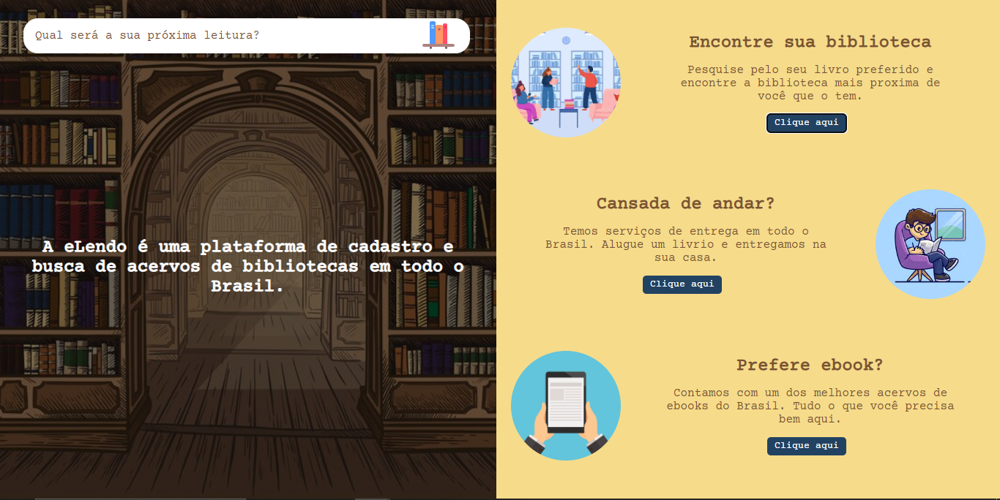

# vs12-front-01-html-e-css-task-04

Tarefa avaliativa do 4° dia do Programa Vem Ser, 12ª Edição.  Desenvolvedores: Monara Calado e Rafael Esteque

    <a href="#-tecnologias">Tecnologias</a>&nbsp;&nbsp;&nbsp;|&nbsp;&nbsp;&nbsp;
    <a href="#-sobre-o-projeto">Sobre o Projeto</a>&nbsp;&nbsp;&nbsp;

  

## 🚀 Tecnologias

Esse projeto foi desenvolvido com as seguintes tecnologias:

- HTML
- CSS
- Figma

## 💻 Sobre o Projeto

A eLendo é uma plataforma de cadastro e busca de acervos de bibliotecas em todo o Brasil. Através dela, um leitor pode pesquisar gratuitamente sobre a disponibilidade de qualquer livro dentro das instituições participantes.

A proposta da empresa é oferecer também o serviço de envio e retirada de livros, de e para qualquer endereço atendido pelos correios.

Para os assinantes do produto pago, é possível receber um livro em casa por mês.

<a href="https://www.figma.com/file/uW66JzJsa2Rze1Lb9aaqV4/Elendo?node-id=0%3A1&mode=dev">Veja aqui</a> o projeto no Figma.

